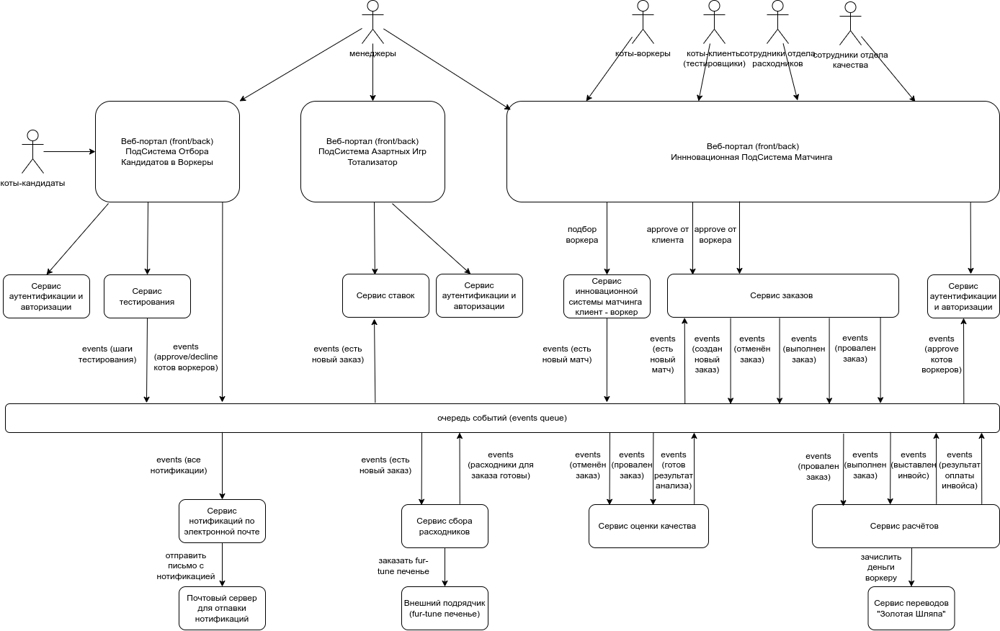

# Нулевая домашка

## Структура системы

Общая диаграмма с элементами, из которых состоит система Make cats free again (далее MCF) приведена ниже на рисунке

Что где находится и как элементы связаны между собой вызовами или событиями.

## Описание системы

Проектируемая система MCF состоит из следующих подсистем:

- `ПодСистема Отбора кандидатов в воркеры`
- `Подсистема Азартных Игр (Тотализатор)`
- `Инновационная ПодСистема Матчинга`

Принято решение разбить Систему MCF на три Подсистемы по следующим причинам:

- в случае наплыва посетителей - кандидатов в воркеры на отборочные тесты, как по естественным причинам, так и в результате злонамеренных действий извне (происки конкурентов) остальные части Системы не должны пострадать и продолжать стабильно функционировать
- азартные игры в формате тотализатор носят незаконный характер в контексте налогового законодательства, поэтому данная часть системы, очень привлекательная для менеджеров, в целях безопасности также должна существовать отдельно от остальных Подсистем
- инновационная `ПодСистема Матчинга` должна стабильно функционировать в случае любых проблем с остальыми двумя подсистемами

Каждая из подсистем состоит из набора сервисов. Разбиение на сервисы обосновано наличием различных требований по функционалу, возможностью быстрой доработки того или иного сервиса в случае каких-либо изменений требований.
Для асинхронных коммуникаций используется так называемая очередь событий (events queue), позволяющая оповещать сервисы об изменении какого-либо состояния, например отправлять нотификации для рассылки уведомлений по почте.

Далее подробно по каждой из ПодСистем

В состав `ПодСистемы Отбора кандидатов в воркеры` входят следующие сервисы:

- фронт/бэк для работы с кандидатами и доступа со стороны менеджеров
- сервис аутентификации и авторизации пользователей Подсистемы (кандидаты на позиции воркеров, менеджеры)
- сервис тестирования (конфигурирование набора тестов, результаты тестов)
- очередь событий (events queue)

В состав `Подсистемы Азартных Игр (Тотализатор)` входят следующие сервисы:

- фронт/бэк для приёма ставок от менеджеров
- сервис аутентификации и авторизации пользователей Подсистемы (менеджеры, старший менеджер)
- сервис игорных ставок (хранение ставок на результат выполнения каждого заказа)
- очередь событий (events queue)

В состав `Инновационной ПодСистемы Матчинга` входят следующие сервисы:

- фронт/бэк для матчинга задач от клиентов с воркерами
- сервис аутентификации и авторизации пользователей Подсистемы (клиенты, воркеры, менеджеры, сотрудники отдела сбора расходников, сотрудники отдела качества)
- сервис матчинга (с уникальной технологией матчинга между клиентами и воркерами)
- сервис заказов (создание заказа, отмена заказа, результаты выполнения заказа)
- сервис расчётов (выставление счетов для клиентов, оформление зачислений для воркеров через платёжную систему "Золотая шляпа")
- сервис оценки качества (анализ отменённых или провальных заказов)
- сервис сбора расходных материвалов для выполнения заказа воркером
- сервис нотификации по почте (с подключением к почтовому серверу)
- очередь событий (events queue)

Спорным моментом является использование отдельного сервиса аутентификации и авторизации для каждой их ПодСистем.
Ошибочность такого подхода может выясниться на более поздних этапаха проектирования Системы.
