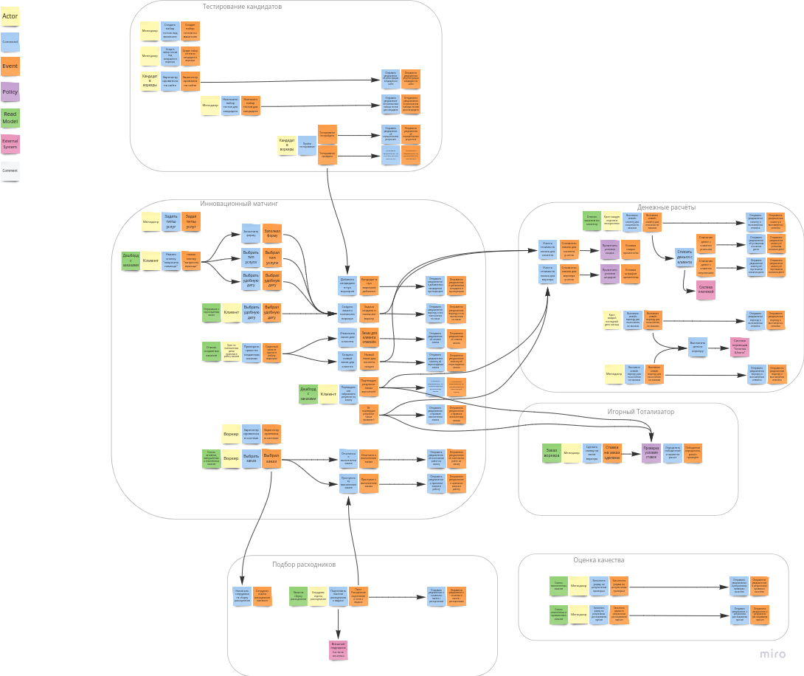
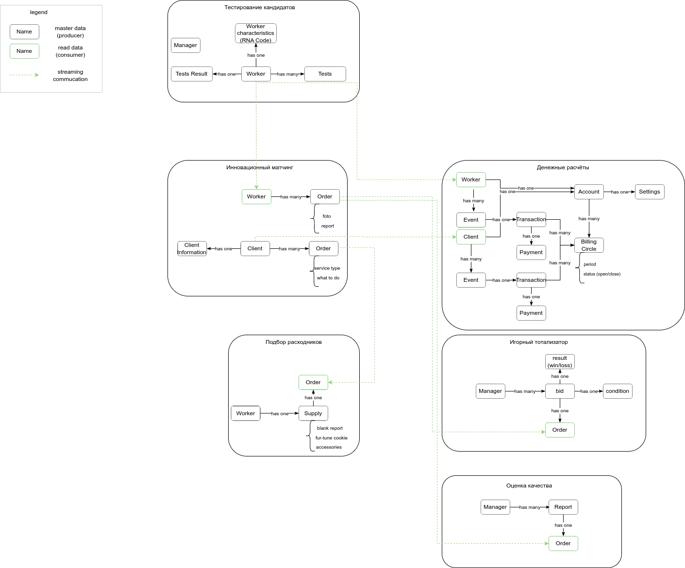
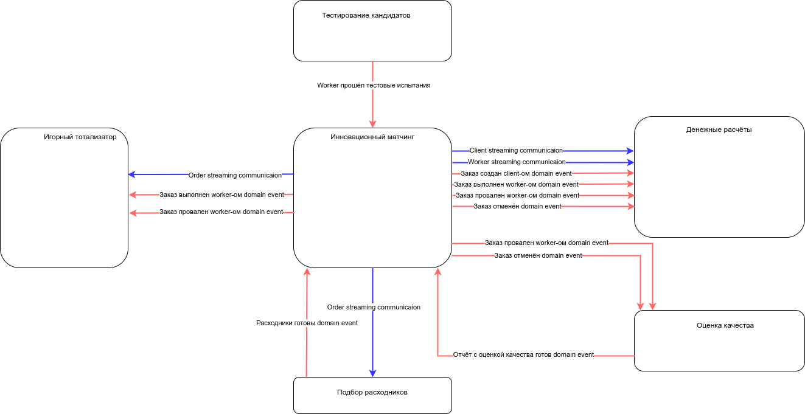

# Первая домашка курса АС 2

## Результаты Event Storming

Ссылка на [исходник Event Storming модели проекта](https://miro.com/app/board/uXjVNMffVyc=/?share_link_id=175963579612)

В соответствии с требованиями принято решение сгруппировать команды и сообытия в следующие контексты:

- Инновационный Матчинг (здесь все команды и события связанные с заказами и взаимодействием между клиентом и воркером)
- Тестирование Кандидатов (здесь все команды и события связанные с первичным отбором кандидатов в воркеры)
- Подбор Расходников (здесь все команды и события связанные с отделом подбора расходников)
- Оценка Качества (здесь все команды и события связанные с отделом оценки качества)
- Денежные Расчёты (здесь все команды и события имеющие отношения к подготовке и проведению денежных расчётов с клиентами и воркерами)
- Игорный Тотализатор (здесь все команды и события связанные с игорной активностью менеджеров)

## Результаты подготовки модели данных

В соответствии с требованиями подготовлена следующая модель данных:

## Результаты подготовки общей модели всех полученных коммуникаций в системе

В соответствии с требованиями подготовлена следующая модель всех полученных коммуникаций в системе:

На данном этапе предлагается сделать вариант реализации гибрид, то есть:

- контексты `Инновационный Матчинг`, `Денежные Расчёты`, `Игорный Тотализатор`, `Подбор расходников`, `Оценка качества` объединить в монолит
- контекст `Тестирование Кандидатов` можно вынести в отдельный сервис
