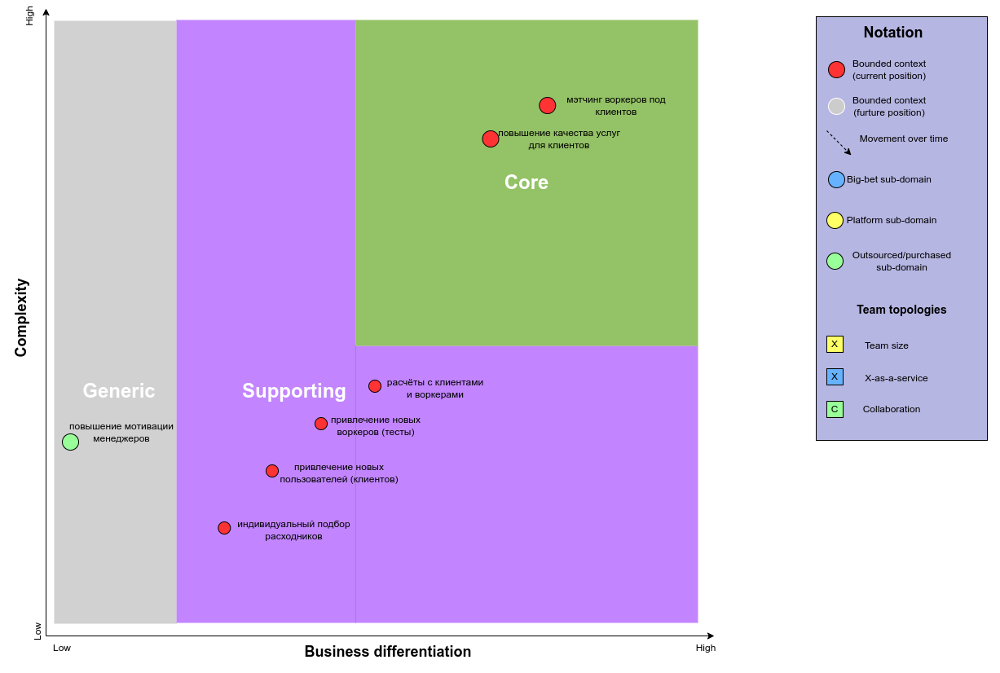
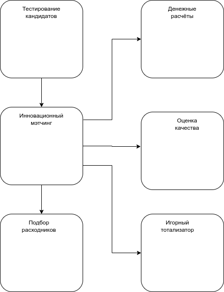
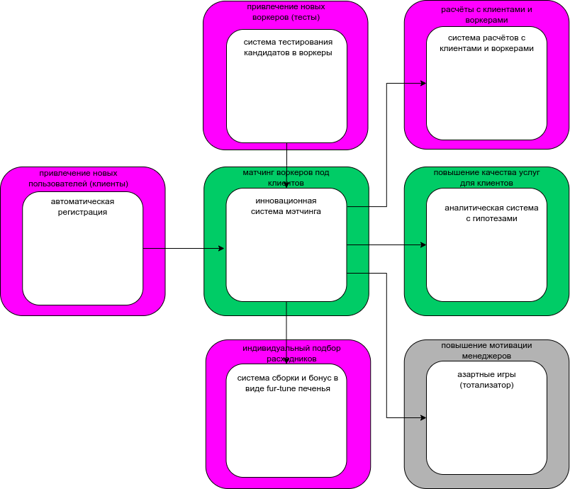
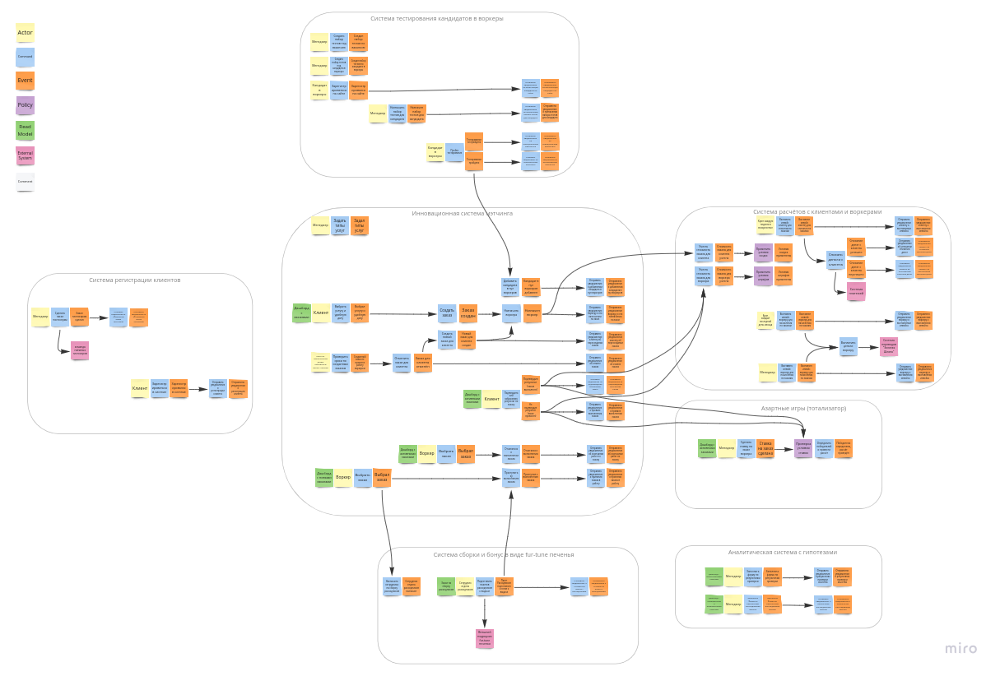
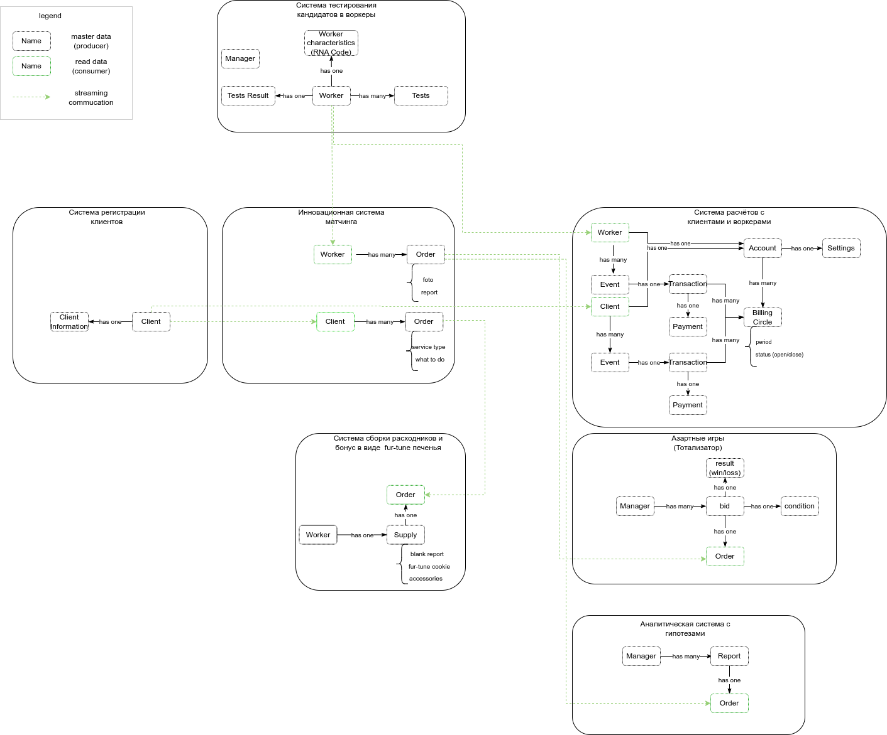
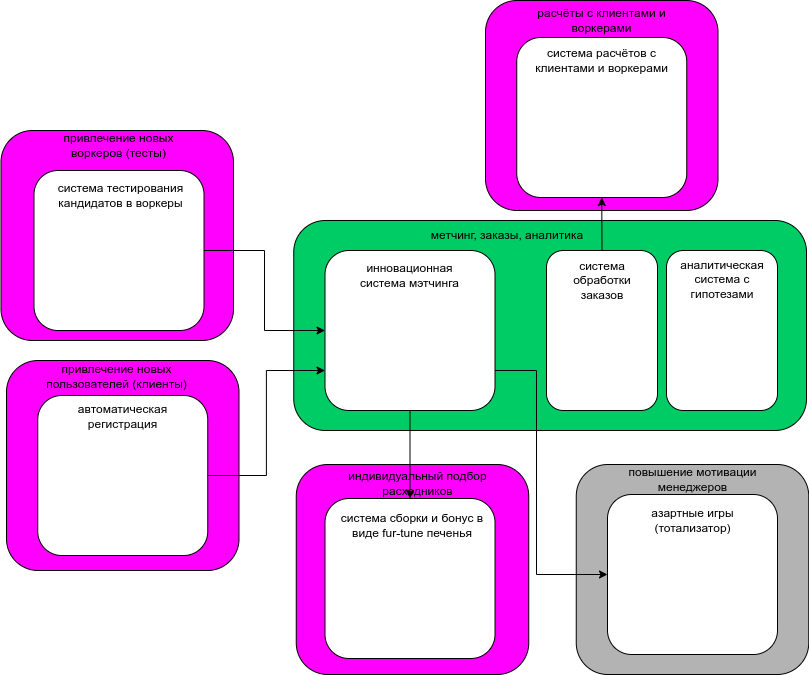

# Вторая домашка курса АС 2

## 1.1 Выпишите все поддомены, которые вы нашли в системе

Под новым углом зрения образовались следующие поддомены:

|    Вид поддомена                            |   Конкурентное преимущество   |   Сложность   |   Изменчивость   |
|---------------------------------------------|-------------------------------|---------------|------------------|
| мэтчинг воркеров под клиентов               |          да                   |    высокая    |    частая        |
| работа с уровнем качества услуг             |          да                   |    высокая    |    частая        |
| расчёты с клиентами и воркерами             |          нет                  |    высокая    |    редкая        |
| индивидуальный подбор расходников           |          нет                  |    низкая     |    редкая        |
| привлечение новых воркеров (тесты)          |          нет                  |    низкая     |    частая        |
| привлечение новых пользователей (клиентов)  |          нет                  |    низкая     |    редкая        |
| повышение мотивации менеджеров              |          нет                  |    низкая     |    редкая        |

## 1.2 Определите все типы поддоменов и заполните core domain chart

На основании таблицы с поддоменами составлен следующий чарт с распределением поддоменов по типам:

## 2.1 Определите боундед-контексты для каждого из поддоменов, основываясь на требованиях (хватит одной модели, как было в уроке)

По результатам некоторых измышлений составлено соответствие между поддоменами и боундед-контекстами:

|    Вид поддомена                            |   Предполагаемый вид поддомена   |  Выделенный  боундед-контекст                   |
|---------------------------------------------|----------------------------------|-------------------------------------------------|
| мэтчинг воркеров под клиентов               |          core                    |  инновационная система мэтчинга                 |
| работа с уровнем качества услуг             |          core                    |  аналитическая система с гипотезами             |
| расчёты с клиентами и воркерами             |          supporting              |  система расчётов с клиентами и воркерами       |
| индивидуальный подбор расходников           |          supporting              |  система сборки и бонус в виде fur-tune-печенья |
| привлечение новых воркеров (тесты)          |          supporting              |  система тестирования кандидатов в воркеры      |
| привлечение новых пользователей (клиентов)  |          supporting              |  система автоматической регистрации             |
| повышение мотивации менеджеров              |          generic                 |  азартные игры (тотализатор)                    |

## 3.1 Сравните полученные боундед-контексты из поддоменов и боундед-контексты, полученные из ES. Опишите, что разошлось (можно показать на картинке в сравнении) и предположения, почему так получилось

Сделана попытка сравнения боундед-контекстов из первого и второго уроков.

- боундед-контексты из первого урока, полученные из Events Storming:

- боундед-контексты из второго урока, полученные из поддоменов:

Наименования боундед-контекстов в первом и во втором случае немного отличаются, но по расположению элементов ясно, где есть отличия. Во втором случае добавился контекст связанный с привлечением клиентов.
В остальном наборы контекстов из первого и второго урока примерно повторяют друг друга.
Отсутствие контекста, связанного с привлечением клиентов в первом уроке было из-за отстуствия чётких требований, как это вообще должно происходить.

## 3.2 Сделайте исправленную версию ES-модели и модели данных, если боундед-контексты разошлись. Если не разошлись — приложите ES и модель данных из прошлого урока

По результатам сравнения боундед-контекстов сделана корректировка ES-модели:

Ссылка на [исходник Event Storming модели проекта](https://miro.com/app/board/uXjVNJ4_xP8=/?share_link_id=144574744985)

По результатам сравнения боундед-контекстов также сделана корректировка модели данных:

## 4.1 Выпишите характеристики, важные для проекта. В нашем случае мы не можем спросить у бизнеса, что важно, а что нет

Ниже приведён субъективный рейтинг характеристик, с проставленной степенью важности и комментариями по каждой характеристике

|    Характеристика         |   Важность    |     Комментарий                                                                                                                                |
|---------------------------|---------------|------------------------------------------------------------------------------------------------------------------------------------------------|
| Availability              |    высокая    |  характеристика "размазана" по всем требованиям, напрямую влияет на удовлетворённость пользователей и конкурентное преимущество                |
| Scalability               |    высокая    |  как минимум прямо упоминается в требовании [US-081] система должна будет выдержать наплыв котов клиентов и кандидатов в воркеры               |
| Modifiability             |    высокая    |  система не должна скатиться в big ball of mud, это также "размазано" по требованиям, конкуренты не дремлют и мечтают опозорить                |
| Maintainability           |    высокая    |  даже если систему "положат" [US-081] она должна быть быстро восстановлена, позора быть не должно                                              |
| Securability              |    средняя    |  в требовании [US-101] говорится, что валидации уникальности нет, поэтому возможны случаи, когда воркер будет не тот, за которого себя выдаёт  |
| Performance               |    средняя    |  судя по тому, что все уведомления рассылаются по электронной почте, то характеристика важна, но не критична, как остальные                    |
| Agility                   |    низкая     |  преположительно система обладает уникальной системой матчинга ([US-060],[US-290]) и не надо бояться конкурентов :)                            |
| Testability               |    низкая     |  новый функционал предполагается добавлять ([US-180]), но непонятно, как это будет проверяться, так как разработчики на своей волне ([US-290]) |
| Deployability             |    средняя    |  новый функционал предполагается добавлять, но только после внимательного прочтения аналитики ([US-180])                                       |
| Usability                 |    средняя    |  пока что это на среднем уровне, поскольку все уведомления отправляются по почте, не всем клиентам это может показаться удобным                |
| Consistency               |    низкая     |  всё таки это не биржевая торговля и спекуляции на валютном рынке                                                                              |
| Simplicity                |    средняя    |  простота имеет значение, чтобы пользователи не отваливались [US-070], [US-112], [US-120]                                                      |

## 5.1 Выберите один из четырёх архитектурных стилей, описанных в уроке. Опишите, почему вы сделали такой выбор и по каким характеристикам сравнивали стили (можно использовать картинку из урока со сравнением стилей)

Выбор лежит где-то между service-based architecture style и microservices architecture style. Возможно оптимальный вариант пока что, всё таки service-based architecture style.

## 6.1 Сделайте итоговую модель системы, укажите виды коммуникаций между элементами, если выбрали распределённый стиль

Пока что решено остановиться на service-based architecture style и возникло ощущение, что можно объединить в один поддомен контексты мэтчинга с аналитикой.
И в последний момент попросилось обозначиться как отдельный боундэд-контекст "управление заказами" в составе этого же поддомена. ES модель уже не стал ещё раз перелопачивать, так как там всё тесно переплетается.

