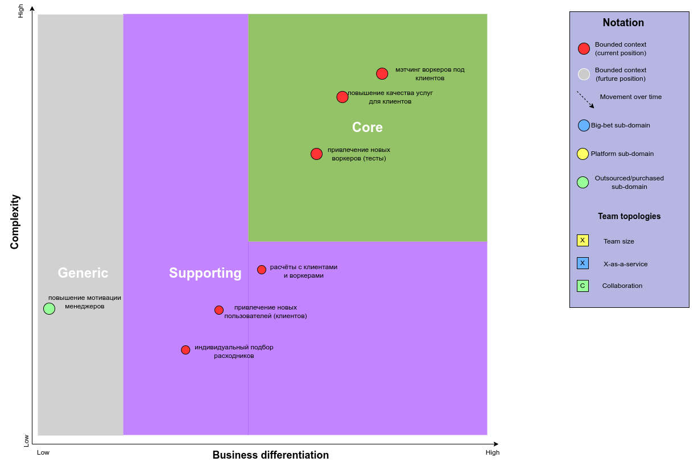
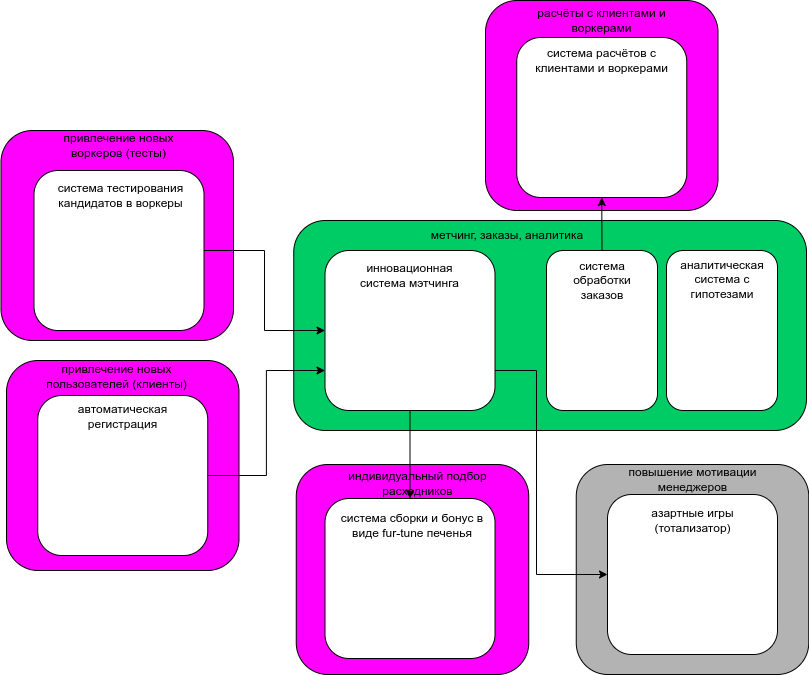

# Третья домашка курса АС 2

## 1.1 попробуйте расписать стейкхолдеров по группам из урока. Попутно пофантазируете, кого потенциально мы забыли указать в списке стейкхолдеров

|    ID  |   Стейкхолдер           |                                     Консёрны                                                             |
|--------|-------------------------|----------------------------------------------------------------------------------------------------------|
|   1    |  Топ-менеджмент         |  хочет продавать скоринг потенциальных работников другим компаниям и тестировать больше гипотез          |
|        |                         |  хочет каждый месяц получать новый релиз всей системы                                                    |
|        |                         |  хочет каждую неделю получать новый релиз системы скоринга потенциальных работников                      |
|   2    |  Менеджеры              |  желают, чтобы о системе ставок не знали другие отделы, иначе будет некрасивая ситуация                  |
|        |                         |  хотят скрыть эту систему даже от разработчиков, которые не будут ей заниматься, и от начальства         |
|        |                         |  от пользователей поступают восторженные отзывы и нагрузка может оказаться на несколько порядков больше  |
|   3    |  Финотдел               |  хотят списывать деньги с клиентов раз в месяц                                                           |
|        |                         |  необходимо постоянно добавлять новые способы списания денег для клиентов                                |
|        |                         |  воркеры всегда работают через компанию «Золотая шляпа»                                                  |
|   4    |  Разработчики           |  система должна работать без сбоев, а если сбой случается, то должно быть понятно, что и где чинить      |
|   5    |  Админы                 |  простота мониторинга системы для своевременного замечания сбоев, чтобы не работать в авральном режиме   |
|   6    |  Юристы                 |  соответствие всей системы правовым нормам                                                               |
|   7    |  Логисты                |  боятся потерять информацию по актуальным заказам                                                        |
|        |                         |  боятся оказаться крайними при отмене заказов (нет расходников, нельзя выполнить заказ)                  |
|   8    |  Аналитики по качеству  |  боятся потерять информацию по проваленным или отменённым заказам                                        |
|        |                         |  отсутствие данных по проваленным или отменённым заказам тормозит развитие системы матчинга              |
|   9    |  Клиенты                |  хотят ожидаемое поведение системы: без сбоев и тупняков                                                 |
|        |                         |  хотят простой и понятный пользовательский интерфейс                                                     |
|--------|-------------------------|----------------------------------------------------------------------------------------------------------|

По результатам анализа требований внесены изменения в чарт с распределением поддоменов по типам:

и скорректировано соответствие между поддоменами и боундед-контекстами:

|    Вид поддомена                            |   Предполагаемый вид поддомена   |  Выделенный  боундед-контекст                   |
|---------------------------------------------|----------------------------------|-------------------------------------------------|
| мэтчинг воркеров под клиентов               |          core                    |  инновационная система мэтчинга                 |
| привлечение новых воркеров (тесты)          |          core                    |  система тестирования кандидатов в воркеры      |
| работа с уровнем качества услуг             |          core                    |  аналитическая система с гипотезами             |
| расчёты с клиентами и воркерами             |          supporting              |  система расчётов с клиентами и воркерами       |
| индивидуальный подбор расходников           |          supporting              |  система сборки и бонус в виде fur-tune-печенья |
| привлечение новых пользователей (клиентов)  |          supporting              |  система автоматической регистрации             |
| повышение мотивации менеджеров              |          generic                 |  азартные игры (тотализатор)                    |

## 2.1 выберите один из семи архитектурных стилей, описанных в уроке. Опишите, почему вы сделали такой выбор и по каким критериям сравнивали стили (можно использовать картинку из урока со сравнением стилей)

Будем ориентироваться на следующие характеристики:

- availability
- scalability
- modifiability
- maintainability

В результате выбран microservices architecture style, поскольку он выигрывает по данным характеристикам, по сравнению с остальными вариантами.

Ранее были определены следующие боундед-контексты:

Полагаем теперь, что каждому боундед контексту соотвествует отдельный сервис.

Выбраны следующие стили для каждого из сервисов:

|    Сервис                            |   стиль сервиса       |  Обоснование для выбора               |
|--------------------------------------|-----------------------|-------------------------------------- |
| Привлечение новых воркеров (скоринг) |    layered-монолит    | один контекст                         |
| Привлечение новых пользователей      |    layered-монолит    | один контекст                         |
| Расчёты с клиентами и воркерами      |    modular-монолит    | подключение разных платёжных систем   |
| Матчинг, заказы, аналитика           |    modular-монолит    | ранее было два разных контекста       |
| Индивидуальный подбор расходников    |    layered-монолит    | один контекст                         |
| Повышение мотивации менеджеров       |    layered-монолит    | один контекст                         |

## 3.1 выберите нужный вид баз данных для каждого из полученных сервисов. Если у вас получился один монолит — определите необходимый вид базы для этого монолита. Опишите, почему вы сделали такой выбор и какие критерии использовали для выбора

Результаты выбора вида базы данных для сервисов:

|    Сервис                            |   требуемый вид базы данных   |  Обоснование для выбора  |
|--------------------------------------|-------------------------------|--------------------------|
| Привлечение новых воркеров (скоринг) |          RDBMS                | compliance, consistency  |
| Привлечение новых пользователей      |          RDBMS                | compliance, consistency  |
| Расчёты с клиентами и воркерами      |          RDBMS                | compliance, consistency  |
| Матчинг, заказы, аналитика           |          RDBMS                | consistency              |
| Индивидуальный подбор расходников    |          RDBMS                | consistency              |
| Повышение мотивации менеджеров       |          RDBMS                | compliance, consistency  |

Обснование:

- для сервисов `Матчинг, заказы, аналитика`,`Индивидуальный подбор расходников` важна консистентность
- для сервисов `Привлечение новых воркеров (скоринг)`, `Привлечение новых пользователей`, `Расчёты с клиентами и воркерами`, `Повышение мотивации менеджеров` важны консистентность и комплаенс.

## 4.1 выберите нужный стиль коммуникаций и их вид (синхронный/асинхронный). Опишите, почему вы сделали такой выбор и какие критерии использовали для выбора

Между сервисами предполагается:

- стиль коммуникации event-driven (порожднение события и реагирование на него консьюмерами)
- вид коммуникаций asynchronous nonblocking (асинхронно неблокирующие)

Обоснование:

- в системе в целом нет необходимости в получении мгновенного результата, временная задержка допустима
- поток событий происходит в одном направлении
- на одно событие могут реагировать один и более сервисов

## 5.1 предположите, какие фитнес-функции можно использовать для валидации итоговой системы. Можете считать, что система будет делаться с использованием любого языка программирования, следовательно, можете выбрать любые инструменты из любой экосистемы

_Общие для всей системы:_

- проверка покрытия тестами не ниже 90%;
- проверка периодичности релиза не реже раза в месяц;
- проверка schema-registry, в которой контролируются события в системе.

_Привлечение новых воркеров (скоринг):_

- проверка реализации архитектурного стиля
- проверка периодичности релиза не реже раза в неделю;
- прохождение нагрузочных тестов scalability и elasticity;
- анализ метрик coupling и cohesion

_Привлечение новых пользователей:_

- проверка реализации архитектурного стиля
- прохождение нагрузочных тестов scalability и elasticity;
- анализ метрик coupling и cohesion

_Расчёты с клиентами и воркерами:_

- анализ метрик coupling и cohesion

_Матчинг, заказы, аналитика_:

- проверка реализации архитектурного стиля
- проверка периодичности релиза не реже раза в две недели
- анализ метрик coupling и cohesion

_Индивидуальный подбор расходников_:

- анализ метрик coupling и cohesion

_Повышение мотивации менеджеров_:

- анализ метрик coupling и cohesion

## 6.1 сделайте ADR, опишите принятие решения по изоляции одного из элементов как изолированного сервиса

Ниже приведено содержание ADR по проектируемому сервису привлечения новых воркеров (workers scoring)

## WS-001: Привлечение новых воркеров (workers scoring)

**Status**: Proposed

## Context

Ранее распознанный боундед контекст `Привлечение новых воркеров` планируется выделить в отдельную единицу по следующим причинам:

- потенциальная уникальность функционала
- может быть востребовано на рынке и выделено в отдельный программный продукт
- в случае высокой нагрузки должен уметь быстро масштабироваться
- падение при переподписке не должно повлиять на работу остальной системы

## Decision

Поскольку в целом выбрана мультисервисная архитектура системы, решено выделить данный боундед контекст в отдельный сервис.
Для обеспечения работоспособности под высокой нагрузкой предполагается масштабирование количества инстансов сервиса и разделение функционала на чтение и запись.
В качестве базы данных предполагается использовать БД RDBMS типа, так что инстансы сервиса для чтение и запись работали с раздельными инстансами БД.
Между инстансами БД на чтение и запись должна быть предусмотрена синхронизация данных с заданной периодичностью.

## Consequences

Сервис в случае успешной апробации под нагрузкой может быть выделен в отдельный продукт и предлагаться на рынке программного обеспечения заинтересованным лицам и компаниям.

## Сompliance

Должно быть предусмотрено:

- функциональное тестирование на клиентах добровольцах, которые позволит выявить косяки в алгоритмах работы сервиса или их осутствие
- нагрузочное тестирование, которое покажет способность сервиса противостоять наплыву пользователей
