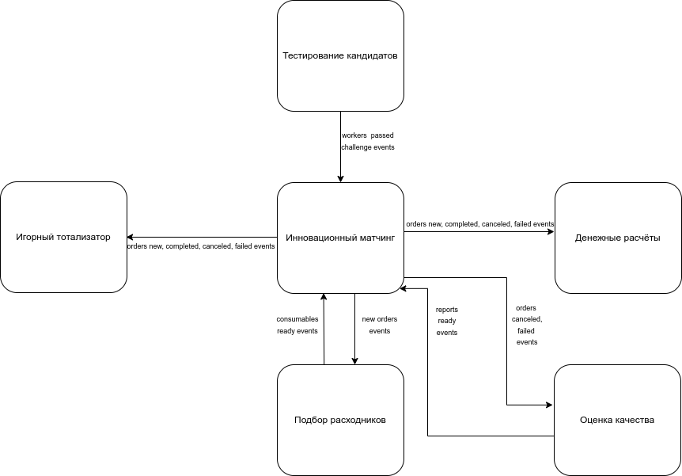
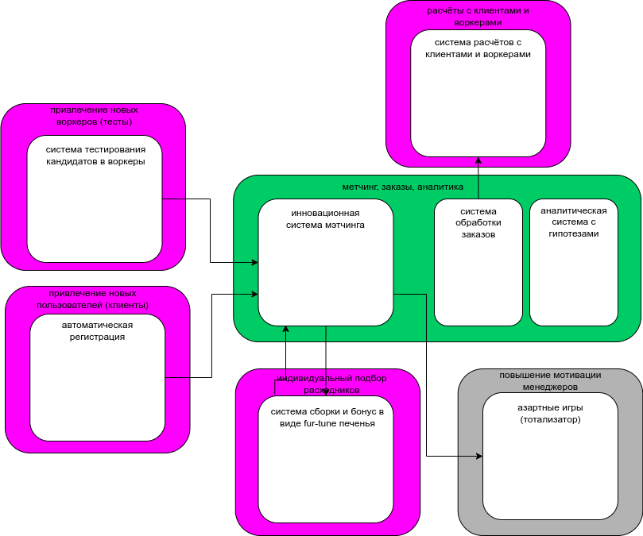
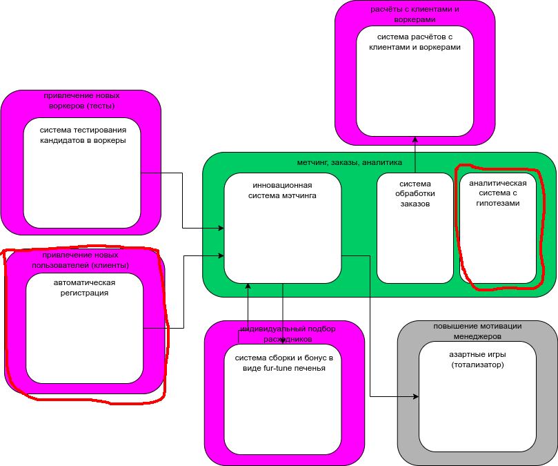

# Четвёртая домашка курса АС 2

В качестве «начальной системы» выбираем из следующих вариантов:

- система, которую получена после нулевой домашки
- реализация системы из первого урока
- структура системы, предложенная на данном уроке

Посмотрел и решил не брать, то что было на нулевой домашке и в качесте начальной системы выбрал то, что получилось после первого урока.

То что получилось в третьем уроке:

## для каждого сервиса который добавится или удалится и связанных с ним сервисов посчитайте значение instability

При сравнении видно следующее:

- добавляется боундед контекст `привлечения новых пользователей (клиентов)` и соответственно сервис `автоматическая регистрация`
- боундед контексты `инновационного матчинга` и `анализа качества` сливаются в один боундед контекст и соответственно сервис `матчинг, заказы, аналитика`

Считаем instability по изменениям:

- сервис `автоматическая регистрация` ноль входящих и одна исходящая связь, instability = 1/(1 + 0) = 1
- сервис `инновационного матчинга` три входящих и четыре исходящих связи, instability =4/(4 + 3) = 0.57
- сервис `матчинг, заказы, аналитика` три входящих и три исходящих связи, instability =3/(3 + 3) = 0.5

Примечание: сервис `инновационного матчинга` превращается в сервис `матчинг, заказы, аналитика`, instability посчитана для сравнения.

## опишите, какие сервисы и боундед-контексты в каком месте и каким образом будут меняться

Как уже было сказано выше, можно говорить об двух изменениям:

- добавление сервиса `автоматическая регистрация` со следующими характеристиками:

|    Сервис                            |   стиль сервиса       |  Обоснование для выбора               |
|--------------------------------------|-----------------------|-------------------------------------- |
| Привлечение новых пользователей      |    layered-монолит    | один контекст                         |

|    Сервис                            |   требуемый вид базы данных   |  Обоснование для выбора  |
|--------------------------------------|-------------------------------|--------------------------|
| Привлечение новых пользователей      |          RDBMS                | compliance, consistency  |

- слияние сервисов `инновационного матчинга` и `анализа качества` в сервис `матчинг, заказы, аналитика` со следующими характеристиками:

|    Сервис                            |   стиль сервиса       |  Обоснование для выбора               |
|--------------------------------------|-----------------------|-------------------------------------- |
| Матчинг, заказы, аналитика           |    modular-монолит    | ранее было два разных контекста       |

|    Сервис                            |   требуемый вид базы данных   |  Обоснование для выбора  |
|--------------------------------------|-------------------------------|--------------------------|
| Матчинг, заказы, аналитика           |          RDBMS                | consistency              |

## спланируйте, как и в какой последовательности будет происходить работа

Хотя в данном уроке рассматривается распиливание монолита на отдельные сервисы, здесь есть обратный вариант, объединения двух сервисов в один.

Рассмотрим два сценария:

- нет людей (не опытные разработчики, но много)

идём от простого к сложному (сначала менее критичное, затем более критичное):

- добавление сервиса `автоматическая регистрация`
- объединение сервисов `инновационного матчинга` и `анализа качества`  в сервис `матчинг, заказы, аналитика`

- нет ресурсов (опытные разработчики, но мало)

идём от сложного к простому (сначала более критичное, затем менее критичное):

- объединение сервисов `инновационного матчинга` и `анализа качества`  в сервис `матчинг, заказы, аналитика`
- добавление сервиса `автоматическая регистрация`
