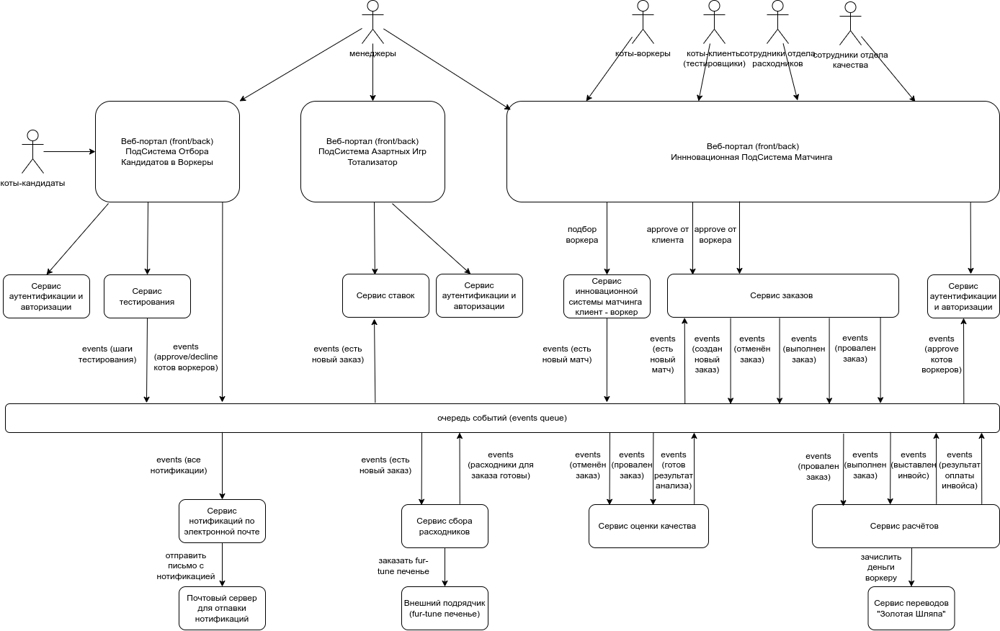
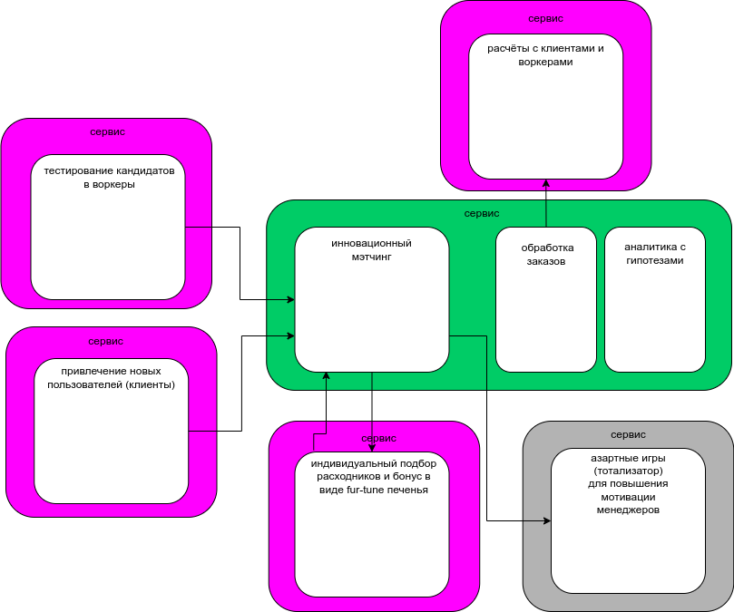
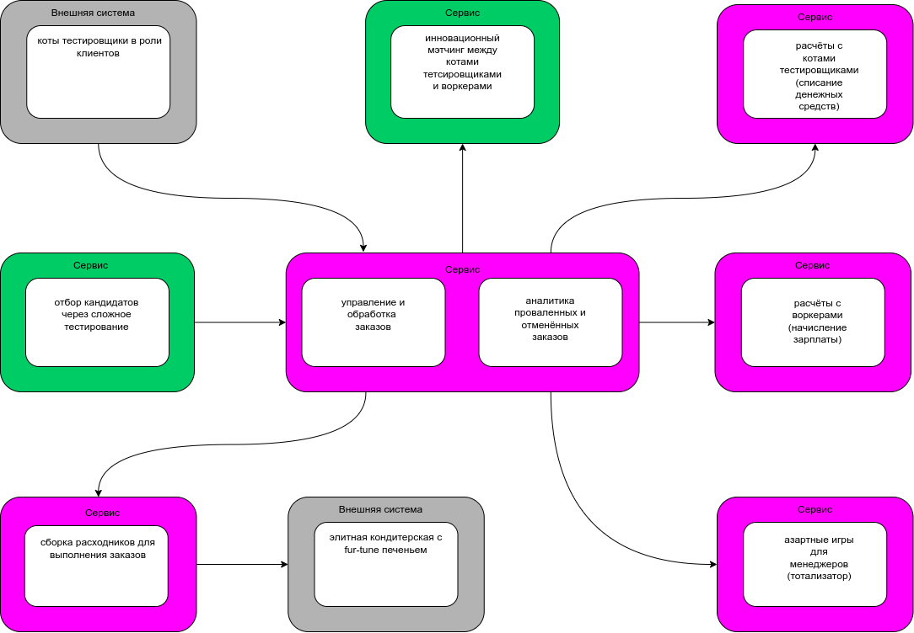

# Пятая домашка курса АС 2

## 1. Достать спроектированную систему из нулевой недели и сравнить её с текущим результатом

Подумал и решил сравнить следующее:

- спроектированную систему из нулевой недели со своим текущим результатом (свои домашки)
- свой текущий результат с вариантом, предложенным на курсе и который плюс минус видел у некоторых коллег при проверки их домашек

## 1.1 Сравнение системы нулевой недели и финального результата из своей домашки

Система по итогам нулевой недели:

Система по итогам своих домашек:

Различия конечно огромны и бросается в глаза следующее:

- тогда я сразу решил запроектировать сложную систему с множеством микросервисом и брокером сообщений, в то же время свой финальный вариант выглядит на порядок проще
- были выделены в отдельные сервисы такие штуки как веб-порталы (целых три раза!), сервисы аутентификации и авторизации (целых три раза!)
- был задуман как отдельная сущность - сервис нотификаций по электронной почте :)
- сервис расчётов предусматривал обслуживание только воркеров, а как же работа с клиентами и списание их денежных средств :)
- удивительно, но мне удалось угадать, что сервис инновационного матчинга и сервис заказов должны быть отдельными сущностями (хотя потом я почему отвернулся от этой идеи или просто забыл про это)
- также тогда удалось примерно понять как будет выглядить взаимодействие сервиса сбора заказов с внешним подрядчиком fur-tune печенья
- так и не смог понять, откуда будут браться коты тестировщики в роли клиентов, вообще как-то к клиентам подошёл не очень внимательно

## 1.2 Сравнение финального результата из своей домашки с условной эталонным вариантом с видеоразбора курса

Система по итогам своих домашек:

Система по итогам курса (эталонный вариант):

Оказалось уже не так всё страшно :)

- тут я "забыл" вынести в отдельный сервис инновационный матчинг
- так же не увидел, что поставщик fur-tune печенья, это внешняя система
- почти догадался, что клиенты должны откуда-то приходить, но только не через свой сервис, а из внешней системы
- не поделил на отдельные сервисы расчёты с клиентами и воркерами

## 2. Выписать идеи и подходы, которые вы хотели бы внедрить в ваших рабочих или других проектах

Думаю, нужно брать всё, что дают :)

1.Последовательность работ:

Сбор требований -> Анализ -> Архитектурные решения

2.В сборе требований:

- работа со стейкхолдерами
- поиск внешних ограничений
- поиск и нахождение характеристик

3.В Анализе:

- event storming
- data modeling
- domain driving design

4.В архитектурных решениях:

- архитектурный стиль системы
- границы сервисов
- типы базы данных
- варианты кромсания монолита
- финтес функции
- ADR (!)
